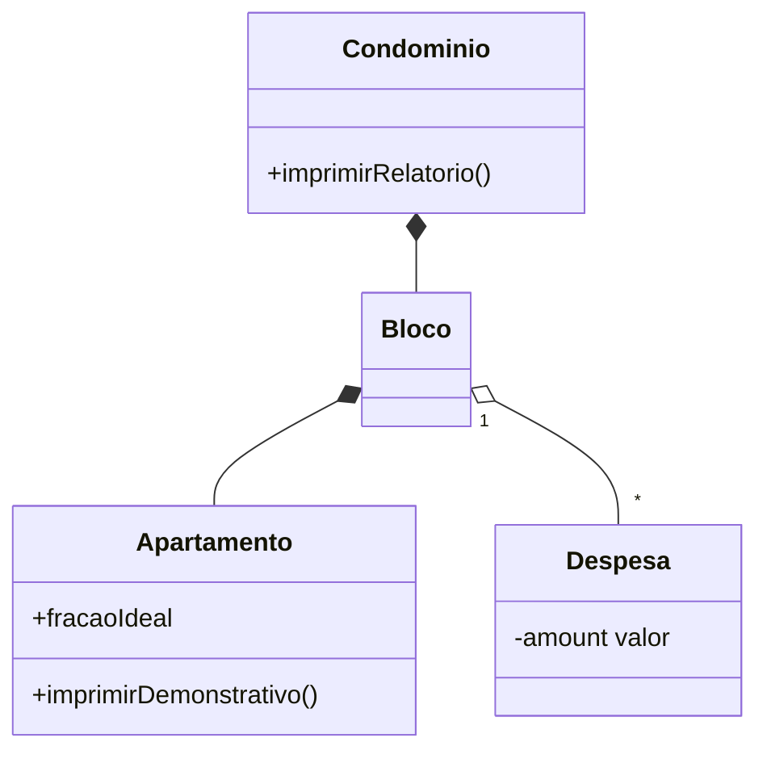

# clases

```mermaid

classDiagram
      Condominio *-- Bloco
      Bloco *-- Apartamento
      Bloco "1" o-- "*" Despesa

      class Apartamento{
          +fracaoIdeal
          +imprimirDemonstrativo()
      }
      class Despesa{
          -amount valor
      }
      class Condominio{
          +imprimirRelatorio()
      }
```
