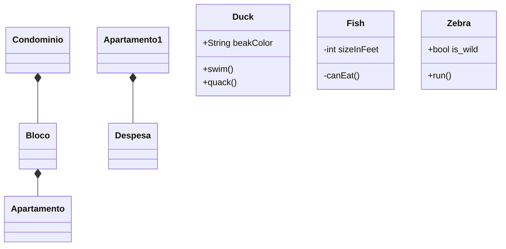

# clases

```mermaid

classDiagram
      Condominio *-- Bloco
      Bloco *-- Apartamento
      Apartamento1 *-- Despesa 

      class Duck{
          +String beakColor
          +swim()
          +quack()
      }
      class Fish{
          -int sizeInFeet
          -canEat()
      }
      class Zebra{
          +bool is_wild
          +run()
      }
```
